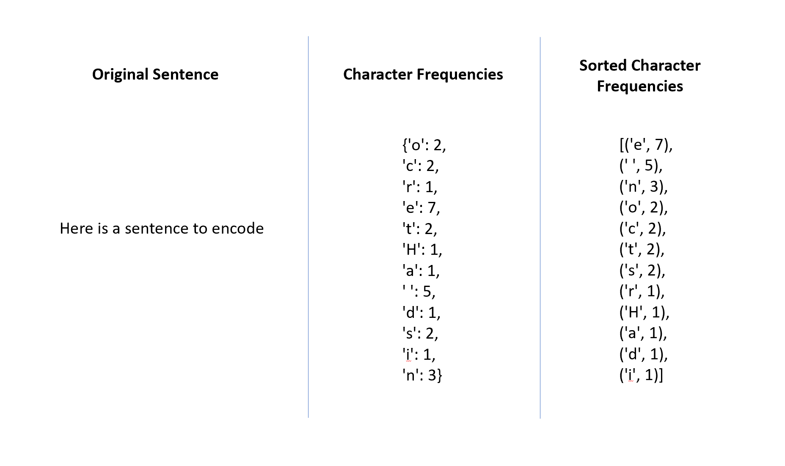
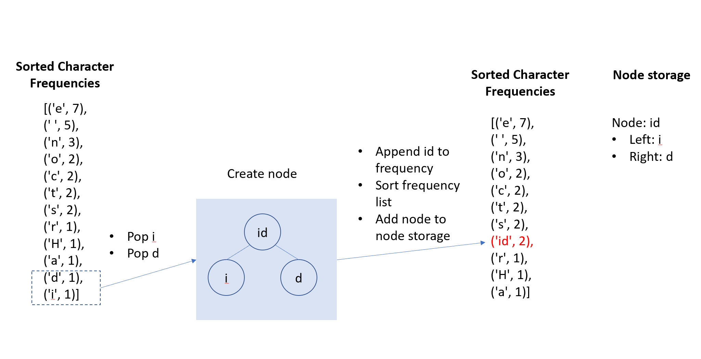
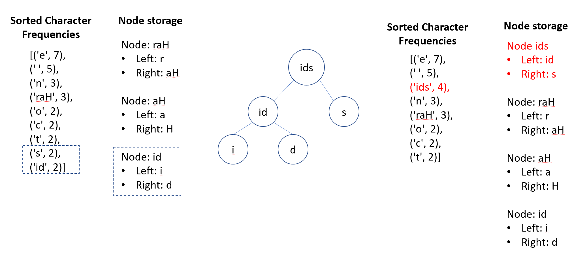

# UD256 Project 2
## About this project
This project consist of a series of tasks that are meant to test the ability to choose the best data structure to accompish a goal

## Problem 1

For a Least-Recent Used Cache implementation, a queue structure makes sense since a queue is a First-In First-Out (FIFO) structure. Therefore the oldest (least recently used) entry would be the first to be removed with O(1) efficiency when the cache reaches the capacity limit. Since the requirement is that all operations are O(1) and since lookup in a typical queue is worst-case O(n), I decided to maintain a dictionary of the key-values pairs for lookup purposes since adding/removing from a dictionary is O(1). When adding to/removing from the cache, both the queue and the dictionary need to be updated. The space complexity is at max the defined capacity for both the queue and the lookup dictionary

## Problem 2

In this problem, the goal is to find all files with a certain extension within a directory and all of its subdirectories.

For this problem, recursion seemed to be a good option because there is a varying number of folders at various depths and you are performing the same search in each folder. I utilized the provided sample folder structure as my test cases. 

Within each recursion, if the input is a directory, then for each item in the directory, recurse and add each returned values to the current list of files. Since there is a loop within a loop, I believe it would be O(n^2) runtime for that portion of the code. If the input to the recursive function is a file that ends with .c, then append it to the list of files (which would be O(1))

## Problem 3

This problem involved implementing Huffman Encoding

In order to gather the frequency of the characters, I used a dictionary where the keys are the character and the value is the frequency count of the character. Scanning through the input string to gather the frequencies is O(n). I chose to use a dictionary since getting/setting values while gathering the frequencies with a dictionary is O(1). I then sort the list so that it is easier to find the two least frequent entries. Sorting is O(n*log(n)). 

*Figure 1: Character Frequencies*

I take the two lowest frequencies, then build a node with the left and right children being those two frequencies and the node value being the sum of those two children. I store the created nodes in a dictionary and store the node's sum back into the list of frequencies so that it can be combined. Each time I store the node's sum back into the list of frequencies, I need to resort the list so that I can get the next two least frequent entries in the updated list. 

*Figure 2: Creating nodes from frequencies*

*Figure 3: Continuing to create nodes from frequencies*

The sorting happens with each loop so I believe this would be O(n^2*log(n)), which I believe is the worst-case efficiency for this code
Eventually, there will be one node left that will become the root of the encoding tree. 

The encoding is generated by traversing the tree in a breadth-first approach and adding a code based on if choosing the left or right node during the traversal. In order to implement the breadth-first approach, a queue is used to correctly order the nodes for traversal. I chose to use breadth-first because it would help order the list so that you would have characters with shorter codes first and characters with longer codes as you traverse deeper in the tree. I thought it would be good to find/replace the longer codes first when decoding. In order to encode, I do a string replace for each character code I built. For decoding, I do the same process but in reverse, replacing the code with a character. I initially had issues here with decoding but giving the root (01), left (0) and right (11) nodes unique codes helped with the decoding so that I wasn’t incorrectly replacing the values with the wrong characters. 

In terms of space complexity, I store the characters with their frequencies as a dictionary, which will depend on the number of unique characters within the sentence to be encoded. While running the algorithm, I am also storing the created nodes in a dictionary, which is also dependent on the number of unique characters in the original sentence. Storing these intermediate values was helpful in executing this algorithm, which is dependent on results from previous steps.

## Problem 4

This problem involved checking whether a user was a member in an Active Directory style group. Similar to Problem 2, recursion seemed to be a good option because there is a varying number of groups at various depths and you are performing the same search in each group. I tried to maintain a list of the groups already checked to avoid revisiting groups already checked if there are any circular references. 

Within each recursion, there is a check to see if the current group has already been checked, which is O(1) since it checks against a set. Then the list of users for this group are checked, which is an O(n) operation. Then we recurse for each subgroup within the group, which is O(n).

## Problem 5

This problem involved creating a simple Blockchain implementation using Linked Lists and hashing. For this problem, I implemented the hashing for the block to be based on the data string, the time created and the previous hash to ensure uniqueness. Basing it only on the data string for example could cause the same hash to be generated if two blocks contained the same data string. In the Blockchain class, the tail is tracked so that adding a block to the end of the Blockchain can be O(1). Printing the chain will iterate through all the blocks so that will be O(n). 

In terms of the space complexity, the blockchain is storing references to the head and tail to make getting to the front and end easy, as well as the size of the blockchain. Each block stores values related to that current block as well as a reference to the previous block. The overall space complexity would depend on the number of blocks

## Problem 6

For the union of the linked lists, I used a set to hold the values while I iterated through each linked list. A set works well since it only maintains unique values. Since I'm iterating through each linked list, the run time would be O(n1+n2) where n1 and n2 are the number of items in each linked list. The space complexity would depend on the number of unique numbers between both linked lists

For the intersection I used two sets. One set holds the values of the first linked list for lookup purposes since looking up values in a set is O(1). The second set is populated with numbers from the second linked list that is also in the first set. Since I'm iterating through each linked list, the run time would also be O(n1+n2). The space complexity would be the number of unique numbers in the first linked list plus the number of unique values that are common between the first and second linked lists